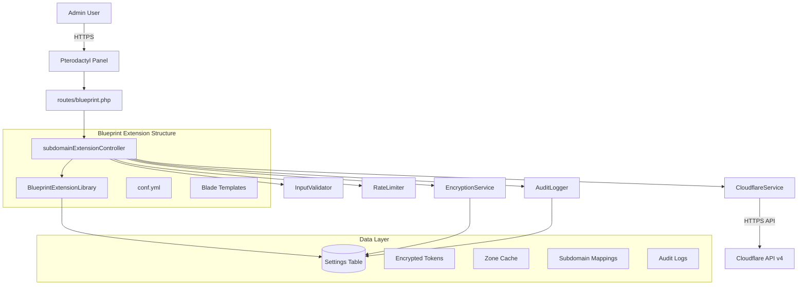
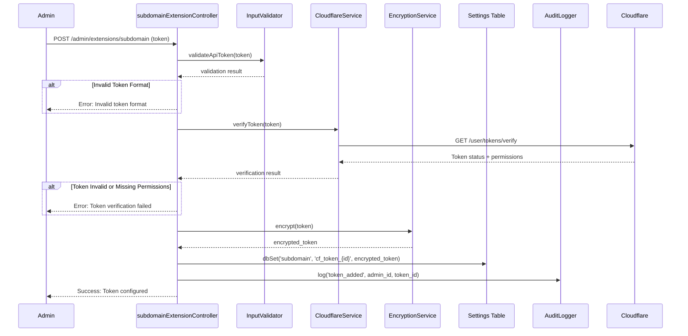
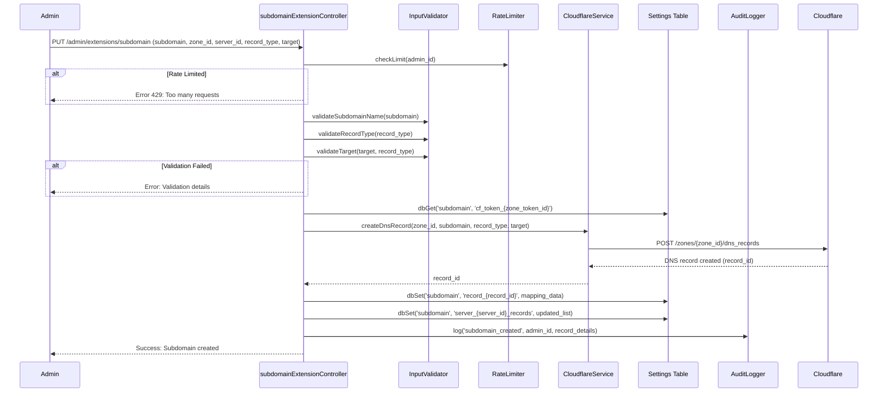
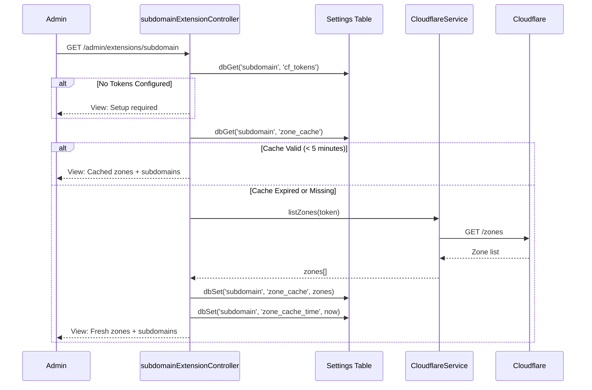

# Design Document: Subdomain Extension

## Overview

The Subdomain Extension is a Blueprint-compatible extension for the Pterodactyl panel that enables administrators to connect Cloudflare API tokens and manage DNS subdomains for servers. It provides a secure interface for configuring Cloudflare zone access, listing available domains, creating/deleting subdomain records that point to panel servers, and viewing a consolidated dashboard of all subdomain-to-server mappings.

The extension follows the established Blueprint extension architecture: it uses the `settings` table via `BlueprintExtensionLibrary` for data persistence, registers admin routes through the standard routing mechanism, and implements a controller with `index`, `update`, `post`, `put`, and `delete` methods. Security is enforced through encrypted token storage, scoped API token validation, input sanitization, rate limiting, and comprehensive audit logging.

## Architecture



## Sequence Diagrams

### Token Configuration Flow



### Subdomain Creation Flow



### Zone Listing Flow



## Components and Interfaces

### Component 1: Extension Configuration (conf.yml)

**Purpose**: Declares the extension to the Blueprint framework

```yaml
info:
  name: 'Subdomain'
  identifier: 'subdomain'
  description: 'Manage Cloudflare subdomains for servers'
  flags: ''
  version: '1.0.0'
  target: 'beta-2026-01'
  author: 'Admin'
  icon: 'subdomain.png'
  website: ''

admin:
  view: 'admin/view.blade.php'
  controller: 'admin/controller.php'

data:
  directory: 'private'
  public: 'public'
```

**Responsibilities**:
- Registers the extension with Blueprint
- Defines admin view and controller paths
- Sets metadata (name, version, icon)

### Component 2: subdomainExtensionController

**Purpose**: Handles all HTTP requests for the extension admin interface

```php
interface SubdomainExtensionControllerInterface {
    // Display the main admin view with zones, subdomains, and server mappings
    public function index(): View|RedirectResponse;
    
    // Update extension settings (e.g., rate limit config, cache TTL)
    public function update(SubdomainUpdateRequest $request): RedirectResponse;
    
    // Add a new Cloudflare API token
    public function post(SubdomainPostRequest $request): RedirectResponse;
    
    // Create a new subdomain DNS record
    public function put(SubdomainPutRequest $request): RedirectResponse;
    
    // Delete a subdomain record or remove an API token
    public function delete(string $target, string $id): RedirectResponse;
}
```

**Responsibilities**:
- Orchestrates all extension operations
- Delegates to services (Cloudflare, Encryption, Audit)
- Returns appropriate views with data
- Enforces admin-only access via AdminFormRequest

### Component 3: CloudflareService

**Purpose**: Encapsulates all interactions with the Cloudflare API v4

```php
interface CloudflareServiceInterface {
    // Verify that a token is valid and has required permissions
    public function verifyToken(string $token): TokenVerificationResult;
    
    // List all zones accessible by the token
    public function listZones(string $token): array;
    
    // List DNS records for a specific zone
    public function listDnsRecords(string $token, string $zoneId): array;
    
    // Create a new DNS record in a zone
    public function createDnsRecord(
        string $token, 
        string $zoneId, 
        string $name, 
        string $type, 
        string $content, 
        bool $proxied = false,
        int $ttl = 1
    ): DnsRecordResult;
    
    // Delete a DNS record from a zone
    public function deleteDnsRecord(string $token, string $zoneId, string $recordId): bool;
}
```

**Responsibilities**:
- Makes authenticated HTTP requests to Cloudflare API
- Handles API response parsing and error mapping
- Enforces timeout and retry policies
- Validates API responses before returning

### Component 4: EncryptionService

**Purpose**: Handles encryption/decryption of sensitive data (API tokens)

```php
interface EncryptionServiceInterface {
    // Encrypt a plaintext value using Laravel's encryption (AES-256-CBC)
    public function encrypt(string $plaintext): string;
    
    // Decrypt an encrypted value back to plaintext
    public function decrypt(string $ciphertext): string;
    
    // Check if a value appears to be encrypted
    public function isEncrypted(string $value): bool;
}
```

**Responsibilities**:
- Uses Laravel's built-in `Crypt` facade (AES-256-CBC with APP_KEY)
- Provides a service layer to allow future migration to other encryption methods
- Validates encrypted payload integrity on decryption

### Component 5: InputValidator

**Purpose**: Validates and sanitizes all user inputs for security

```php
interface InputValidatorInterface {
    // Validate subdomain name format (a-z, 0-9, hyphens only, no leading/trailing hyphens)
    public function validateSubdomainName(string $name): ValidationResult;
    
    // Validate DNS record type (A, AAAA, CNAME only)
    public function validateRecordType(string $type): ValidationResult;
    
    // Validate target/content based on record type
    public function validateTarget(string $target, string $type): ValidationResult;
    
    // Validate Cloudflare API token format (40-char alphanumeric)
    public function validateApiToken(string $token): ValidationResult;
    
    // Validate zone ID format (32-char hex)
    public function validateZoneId(string $zoneId): ValidationResult;
    
    // Sanitize subdomain name (lowercase, trim, remove dangerous chars)
    public function sanitizeSubdomainName(string $name): string;
}
```

**Responsibilities**:
- Prevents DNS injection via subdomain name validation
- Validates IP addresses (IPv4/IPv6) for A/AAAA records
- Validates hostname format for CNAME records
- Rejects dangerous patterns (wildcards unless explicitly allowed, traversal attempts)
- Enforces maximum label length (63 chars) and total name length (253 chars)

### Component 6: AuditLogger

**Purpose**: Records all security-relevant actions for accountability

```php
interface AuditLoggerInterface {
    // Log an action with actor, action type, and details
    public function log(string $action, int $adminId, array $details): void;
    
    // Retrieve recent audit log entries
    public function getRecent(int $limit = 50): array;
    
    // Retrieve audit logs filtered by action type
    public function getByAction(string $action, int $limit = 50): array;
}
```

**Responsibilities**:
- Stores logs in settings table with structured format
- Records: token additions/removals, subdomain creation/deletion, configuration changes
- Includes timestamp, actor ID, action type, affected resource, and result
- Provides retrieval for admin review

## Data Models

### Model 1: Cloudflare API Token (Stored Encrypted)

```php
// Storage key: subdomain::cf_token_{token_id}
interface CloudflareToken {
    token_id: string;         // UUID, generated on creation
    encrypted_token: string;  // AES-256-CBC encrypted API token
    label: string;            // Admin-provided label for identification
    zone_ids: array;          // Array of zone IDs this token can access
    permissions: array;       // Discovered permissions from verification
    added_by: int;            // Admin user ID who added the token
    added_at: string;         // ISO 8601 timestamp
    last_verified: string;    // ISO 8601 timestamp of last verification
}
```

**Storage Pattern**:
- `subdomain::cf_token_{uuid}` → serialized token data
- `subdomain::cf_tokens_index` → JSON array of all token UUIDs

**Validation Rules**:
- Token must be exactly 40 alphanumeric characters
- Label must be 1-100 characters, alphanumeric + spaces + hyphens
- Token must pass Cloudflare verification before storage
- Token must have `Zone:Read` and `DNS:Edit` permissions minimum

### Model 2: Subdomain Record Mapping

```php
// Storage key: subdomain::record_{cloudflare_record_id}
interface SubdomainRecord {
    record_id: string;        // Cloudflare DNS record ID
    zone_id: string;          // Cloudflare zone ID
    zone_name: string;        // Domain name (e.g., "example.com")
    subdomain: string;        // Subdomain label (e.g., "mc1")
    full_name: string;        // Full FQDN (e.g., "mc1.example.com")
    record_type: string;      // A, AAAA, or CNAME
    target: string;           // IP address or hostname target
    proxied: bool;            // Whether Cloudflare proxy is enabled
    ttl: int;                 // TTL in seconds (1 = automatic)
    server_id: int|null;      // Pterodactyl server ID (if assigned)
    server_name: string|null; // Pterodactyl server name (cached)
    token_id: string;         // Which API token manages this record
    created_by: int;          // Admin user ID who created it
    created_at: string;       // ISO 8601 timestamp
}
```

**Storage Pattern**:
- `subdomain::record_{cf_record_id}` → serialized record mapping
- `subdomain::zone_{zone_id}_records` → JSON array of record IDs in this zone
- `subdomain::server_{server_id}_records` → JSON array of record IDs for this server

**Validation Rules**:
- Subdomain: `^[a-z0-9]([a-z0-9-]{0,61}[a-z0-9])?$`
- Record type: must be one of `A`, `AAAA`, `CNAME`
- Target for A record: valid IPv4 address
- Target for AAAA record: valid IPv6 address
- Target for CNAME record: valid hostname (not IP)
- Server ID: must exist in Pterodactyl servers table (or null)

### Model 3: Zone Cache

```php
// Storage key: subdomain::zone_cache
interface ZoneCache {
    zones: array;             // Array of zone objects from Cloudflare
    cached_at: int;           // Unix timestamp of cache creation
    ttl: int;                 // Cache TTL in seconds (default: 300)
    token_id: string;         // Which token was used to fetch
}

// Individual zone structure within cache
interface CachedZone {
    id: string;               // Cloudflare zone ID
    name: string;             // Domain name
    status: string;           // active, pending, etc.
    name_servers: array;      // Assigned nameservers
}
```

**Validation Rules**:
- Cache expires after 5 minutes (300 seconds)
- Zone ID must be 32-character hexadecimal string
- Zone name must be a valid domain name

### Model 4: Audit Log Entry

```php
// Storage key: subdomain::audit_{timestamp}_{random}
interface AuditLogEntry {
    id: string;               // Unique log entry ID
    timestamp: string;        // ISO 8601 timestamp
    admin_id: int;            // Actor user ID
    admin_email: string;      // Actor email (for display)
    action: string;           // Action type enum
    resource_type: string;    // 'token', 'subdomain', 'settings'
    resource_id: string;      // Affected resource identifier
    details: array;           // Action-specific details
    ip_address: string;       // Request IP address
    result: string;           // 'success' or 'failure'
}

// Action types enum
enum AuditAction {
    TOKEN_ADDED,
    TOKEN_REMOVED,
    TOKEN_VERIFIED,
    SUBDOMAIN_CREATED,
    SUBDOMAIN_DELETED,
    SETTINGS_UPDATED,
    ZONE_REFRESHED
}
```

**Storage Pattern**:
- `subdomain::audit_{timestamp}_{random_suffix}` → serialized log entry
- `subdomain::audit_index` → JSON array of recent log entry keys (capped at 500)

### Model 5: Extension Settings

```php
// Storage key: subdomain::settings_{key}
interface ExtensionSettings {
    rate_limit_per_minute: int;   // Max Cloudflare API calls per minute (default: 30)
    cache_ttl: int;               // Zone cache TTL in seconds (default: 300)
    allowed_record_types: array;  // Allowed DNS record types (default: ['A', 'AAAA', 'CNAME'])
    max_subdomains_per_server: int; // Max subdomains per server (default: 5)
    require_server_assignment: bool; // Whether subdomain must link to a server (default: false)
    wildcard_allowed: bool;       // Whether wildcard subdomains are permitted (default: false)
}
```

## Error Handling

### Error Scenario 1: Invalid or Revoked API Token

**Condition**: Token fails Cloudflare verification (401/403 response)
**Response**: Display error message indicating token is invalid or has been revoked. If token was previously valid, mark it as "needs re-verification" in the database.
**Recovery**: Admin must provide a new valid token. Old token data is preserved (encrypted) until explicitly deleted.

### Error Scenario 2: Cloudflare API Rate Limit Exceeded

**Condition**: Cloudflare returns 429 Too Many Requests
**Response**: Return user-friendly message indicating rate limit. Cache the rate limit reset time.
**Recovery**: Automatically retry after Cloudflare's specified retry-after period. Extension-level rate limiter prevents subsequent requests until cooldown expires.

### Error Scenario 3: DNS Record Conflict

**Condition**: Attempting to create a subdomain that already exists in the zone
**Response**: Display error indicating the subdomain already exists. Show the existing record details if available.
**Recovery**: Admin can choose a different subdomain name or delete the existing record first.

### Error Scenario 4: Network Failure to Cloudflare

**Condition**: Connection timeout or DNS resolution failure when contacting Cloudflare API
**Response**: Display error indicating external service unavailability. Use cached data where possible (zone list).
**Recovery**: Automatic retry with exponential backoff (1s, 2s, 4s) up to 3 attempts. If all fail, display cached data with staleness warning.

### Error Scenario 5: Subdomain Name Validation Failure

**Condition**: User submits a subdomain name containing invalid characters or patterns
**Response**: Display specific validation error (e.g., "Subdomain cannot start with a hyphen", "Only lowercase letters, numbers, and hyphens are allowed")
**Recovery**: User corrects input and resubmits. No state change occurs on validation failure.

### Error Scenario 6: Server Not Found

**Condition**: Admin attempts to assign a subdomain to a server ID that doesn't exist
**Response**: Display error that the server was not found
**Recovery**: Admin selects a valid server from the dropdown. Server list is fetched fresh on each page load.

## Testing Strategy

### Unit Testing Approach

- **InputValidator**: Test all validation methods with valid/invalid inputs, boundary cases (63-char labels, empty strings, unicode characters, injection attempts)
- **EncryptionService**: Test encrypt/decrypt round-trip, test with invalid ciphertext, test key rotation scenarios
- **AuditLogger**: Test log creation, retrieval, index management, and cap enforcement
- **CloudflareService**: Mock HTTP client, test response parsing for all endpoints, test error response handling

**Property-Based Testing Approach**:
- **Subdomain validation**: For any valid subdomain name, `sanitize(name) == name` (idempotent sanitization)
- **Encryption round-trip**: For any plaintext, `decrypt(encrypt(plaintext)) == plaintext`
- **Audit log ordering**: Audit entries are always retrievable in reverse chronological order

**Property Test Library**: PHPUnit with data providers (or Pest PHP if available)

### Integration Testing Approach

- Test full token configuration flow with mocked Cloudflare responses
- Test subdomain CRUD operations end-to-end through controller
- Test rate limiting behavior across multiple requests
- Test cache invalidation and refresh cycle
- Test concurrent access scenarios (two admins creating subdomains simultaneously)

## Security Considerations

### Token Storage Security

- API tokens encrypted at rest using Laravel's `Crypt::encryptString()` (AES-256-CBC)
- Encryption key derived from application's `APP_KEY`
- Tokens never logged in plaintext — only last 4 characters shown in UI
- Token verification on first use and periodic re-verification

### Input Validation & Sanitization

- Subdomain names: strict regex whitelist `^[a-z0-9]([a-z0-9-]{0,61}[a-z0-9])?$`
- Zone IDs: `^[0-9a-f]{32}$`
- API tokens: `^[A-Za-z0-9_-]{40}$`
- Record types: enum validation (A, AAAA, CNAME only)
- IP addresses: `filter_var()` with `FILTER_VALIDATE_IP`
- All inputs server-side validated via Laravel FormRequest classes

### Authorization

- All routes protected by `AdminFormRequest` (admin-only access)
- CSRF tokens required on all POST/PUT/PATCH/DELETE forms (Laravel default)
- No public/user-facing endpoints for token management
- Server assignment validates admin has access to the server

### Rate Limiting

- Extension-level: configurable limit (default 30 requests/minute to Cloudflare)
- Per-action throttle: max 10 subdomain creations per minute per admin
- Cloudflare API rate limit monitoring with automatic backoff

### DNS Injection Prevention

- Subdomain names cannot contain dots (prevents subdomain takeover of parent domains)
- No wildcard records unless explicitly enabled by admin
- CNAME targets validated against hostname format
- No TXT or MX records (reduces attack surface for email/domain verification attacks)

### Audit Trail

- All create/delete/modify operations logged with actor, timestamp, IP, and details
- Audit log is append-only (no deletion via extension interface)
- Failed operations are also logged (helps detect brute-force or enumeration)
- Log retention: 500 most recent entries (configurable)

### Scoped Token Enforcement

- Extension validates token has minimum required permissions: `Zone:Read`, `DNS:Edit`
- UI guidance recommends scoped tokens (not global API keys)
- Token format validation rejects global API keys (different format than scoped tokens)

## Performance Considerations

- **Zone Caching**: Cloudflare zones cached for 5 minutes to minimize API calls
- **Lazy Loading**: DNS records loaded on-demand per zone, not all at once
- **Database Queries**: Uses `dbGetMany` for batch reads where possible
- **Pagination**: Subdomain list paginated (20 per page) for large installations
- **Index Structures**: Maintains index arrays (`cf_tokens_index`, `zone_records`, `server_records`) for fast lookups without scanning all settings keys

## Dependencies

- **Laravel Framework** (existing): Encryption, HTTP client, validation, CSRF
- **Blueprint Extension Framework** (existing): Route registration, `BlueprintExtensionLibrary`, admin views
- **Cloudflare API v4**: External service for DNS management (`https://api.cloudflare.com/client/v4/`)
- **Laravel HTTP Client** (Guzzle wrapper): For making HTTP requests to Cloudflare
- **Pterodactyl Server Model** (existing): For server ID validation and name resolution


## Correctness Properties

*A property is a characteristic or behavior that should hold true across all valid executions of a system—essentially, a formal statement about what the system should do. Properties serve as the bridge between human-readable specifications and machine-verifiable correctness guarantees.*

### Property 1: Token Format Validation

*For any* string input, the InputValidator SHALL accept it as a valid Cloudflare API token if and only if it matches the pattern `^[A-Za-z0-9_-]{40}$`. All other strings SHALL be rejected.

**Validates: Requirements 1.1, 1.4**

### Property 2: Permission Set Validation

*For any* set of Cloudflare token permissions returned from verification, the CloudflareService SHALL accept the token if and only if the permission set contains both Zone:Read and DNS:Edit. All permission sets lacking either permission SHALL be rejected.

**Validates: Requirements 1.3, 1.5**

### Property 3: Encryption Round-Trip

*For any* valid plaintext API token, encrypting with the EncryptionService and then decrypting SHALL produce a value identical to the original plaintext token.

**Validates: Requirements 1.6, 8.1**

### Property 4: Encryption Tamper Detection

*For any* encrypted ciphertext, modifying any byte of the ciphertext SHALL cause decryption to fail with an integrity error rather than returning corrupted plaintext.

**Validates: Requirements 8.2, 8.3**

### Property 5: Token Display Masking

*For any* stored API token of length >= 4, the display function SHALL produce output containing only the last 4 characters of the original token, with all preceding characters obscured.

**Validates: Requirement 1.9**

### Property 6: Token Deletion Consistency

*For any* token that is deleted, the token data SHALL no longer exist in the Settings_Table AND the token ID SHALL no longer appear in the `cf_tokens_index`. All other tokens in the index SHALL remain unchanged.

**Validates: Requirements 2.1, 2.2**

### Property 7: Subdomain Name Validation

*For any* string input, the InputValidator SHALL accept it as a valid subdomain name if and only if it matches `^[a-z0-9]([a-z0-9-]{0,61}[a-z0-9])?$`, contains no dots, has a maximum label length of 63 characters, and does not start with a wildcard character (unless wildcard_allowed is enabled). All other strings SHALL be rejected.

**Validates: Requirements 4.3, 9.1, 9.2, 9.4**

### Property 8: Subdomain Sanitization Idempotence

*For any* string input, applying the InputValidator's sanitize function twice SHALL produce the same result as applying it once: `sanitize(sanitize(x)) == sanitize(x)`. The sanitized output SHALL contain only characters matching `[a-z0-9-]`.

**Validates: Requirement 9.5**

### Property 9: Record Type Validation

*For any* string input, the InputValidator SHALL accept it as a valid record type if and only if it is exactly one of "A", "AAAA", or "CNAME". All other strings SHALL be rejected.

**Validates: Requirement 4.4**

### Property 10: Target Validation by Record Type

*For any* target string and record type pair: when record type is "A", the target SHALL be accepted only if it is a valid IPv4 address; when record type is "AAAA", the target SHALL be accepted only if it is a valid IPv6 address; when record type is "CNAME", the target SHALL be accepted only if it is a valid hostname that is not an IP address.

**Validates: Requirements 4.5, 4.6, 4.7**

### Property 11: Zone ID Format Validation

*For any* string input, the InputValidator SHALL accept it as a valid zone ID if and only if it matches the pattern `^[0-9a-f]{32}$`. All other strings SHALL be rejected.

**Validates: Requirement 9.3**

### Property 12: Record Index Consistency Invariant

*For any* sequence of subdomain record creation and deletion operations, the zone record index (`subdomain::zone_{zone_id}_records`) and server record index (`subdomain::server_{server_id}_records`) SHALL always contain exactly the set of record IDs that exist in the Settings_Table for that zone or server respectively.

**Validates: Requirements 4.10, 4.11, 5.2, 5.3**

### Property 13: Cache Validity Determination

*For any* cache timestamp and current time, the Zone_Cache SHALL be considered valid if and only if the difference between current time and cache timestamp is less than the configured TTL (default 300 seconds). Valid caches SHALL be served without API contact; expired or missing caches SHALL trigger a fresh fetch.

**Validates: Requirement 3.2**

### Property 14: Rate Limiter Enforcement

*For any* sequence of requests from an admin within a 60-second window, the Rate_Limiter SHALL allow at most the configured maximum number of requests (default 10 for subdomain creations, 30 for general API calls). The (N+1)th request within the window SHALL be rejected with a 429 response.

**Validates: Requirements 4.1, 11.1, 11.2**

### Property 15: Audit Log Entry Completeness

*For any* action logged by the AuditLogger (whether successful or failed), the log entry SHALL contain all required fields: timestamp, admin ID, admin email, action type, resource type, resource ID, request IP address, and result. No required field SHALL be null or empty.

**Validates: Requirements 1.8, 2.3, 4.12, 5.4, 7.3, 12.2, 12.3, 13.5**

### Property 16: Audit Log Index Cap

*For any* number of audit log entries added to the system, the audit index SHALL never contain more than 500 entries. When the cap is reached, the oldest entries SHALL be removed to make room for new ones, preserving the 500 most recent.

**Validates: Requirement 12.4**

### Property 17: Audit Log Chronological Ordering

*For any* set of audit log entries retrieved from the AuditLogger, the entries SHALL be ordered in reverse chronological order (newest first). For entries with identical timestamps, insertion order SHALL be preserved.

**Validates: Requirement 12.5**

### Property 18: Subdomain Display Completeness

*For any* subdomain record displayed in the dashboard, the rendered output SHALL contain the FQDN, record type, target, associated server name (or "unassigned" indicator), and creation timestamp. No required display field SHALL be absent.

**Validates: Requirements 3.5, 6.2**

### Property 19: Pagination Boundary

*For any* total number of subdomain records, each page of results SHALL contain at most 20 records. The total number of pages SHALL equal ceil(total_records / 20).

**Validates: Requirement 6.5**

### Property 20: Settings Preservation on Invalid Update

*For any* extension setting, if an update request contains an invalid value for that setting, the previous valid value SHALL be preserved in the Settings_Table and the invalid value SHALL not be stored.

**Validates: Requirement 7.4**

### Property 21: Server Existence Validation

*For any* server ID provided during subdomain assignment, the Controller SHALL accept the assignment if and only if a server with that ID exists in the Pterodactyl panel's servers table. Non-existent server IDs SHALL be rejected.

**Validates: Requirement 10.4**
